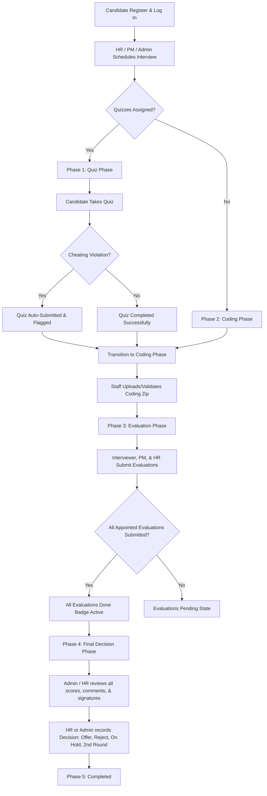

# Hire Guru Interview Portal — Functional & User Flow Documentation

This document explains the end-to-end user flows, state lifecycles, and core functional features of the **Hire Guru** (formerly Quiz-Master) Interview Portal. It maps how Candidates, HRs, Project Managers, Interviewers, and Admins interact with the system to transition a candidate from registration to final selection.

---

## 1. System Overview & Role Matrix

The Hire Guru portal is an enterprise interview and evaluation platform designed to automate and track candidate assessments. 

### Roles & Responsibilities Matrix

| Role | Permissions & Core Responsibilities |
| :--- | :--- |
| **Candidate** | Registers, manages profile, completes assigned aptitude/technical quizzes, uploads coding challenge zip files. |
| **Interviewer** | Conducts assessments, views assigned candidates/groups, uploads & validates coding challenge submissions, provides feedback & candidate recommendation. |
| **Project Manager (PM)** | Initiates individual/group interviews, manages assignments, evaluates candidates, provides technical recommendations. |
| **HR** | Full operational control. Creates/deletes interviews, manages candidates, generates quizzes, reviews all feedback, registers other users, signs/makes the **Final Selection Decision** (Hire, On Hold, Reject). |
| **Admin** | Full system administration. Can manage groups, generate/edit quizzes, review candidate histories, view logs, register all staff, and override/make final decisions. |

---

## 2. Comprehensive Functional Flow Chart



---

## 3. Detailed Step-by-Step State Lifecycle

An interview always progresses through a strict, linear state machine governed by the `status` attribute (`pending` $\rightarrow$ `quiz_phase` $\rightarrow$ `coding_phase` $\rightarrow$ `evaluation` $\rightarrow$ `completed`).

### Phase 1: Registration & Interview Creation
1. **Candidate Registration**: A candidate registers on the portal by entering their name, email, password, and selecting an assessment group (e.g., *Fresher*, *Intern*, *Final Year*).
2. **Scheduling & Assignment**:
   * An Admin, HR, or PM opens the Scheduling Modal.
   * They enter candidate details, position, tech stack, source, date/time, and choose **exactly one** evaluator for each of the three mandatory slots: **Interviewer, PM, and HR**. (Single selection radio-buttons enforce strict ownership).
   * They select one or more Aptitude or Technical Quizzes to assign.
   * **State Transition**: If quizzes are assigned, the interview status is initialized to `quiz_phase`. If no quizzes are assigned, it falls back to `pending`.

### Phase 2: Quiz Phase (Assessment & Anti-Cheat Engine)
1. **Candidate Workspace**: Upon logging in, the candidate is routed to their dashboard where they see the list of active assigned quizzes.
2. **Test Environment**:
   * The candidate enters the standalone `take-quiz` dashboard.
   * A timer starts automatically (pulled from MongoDB).
   * **Full-Screen Enforcement**: The portal requests full-screen mode immediately. If the user cancels it, an alert is shown.
3. **Anti-Cheat Monitoring Engine**:
   * The frontend active monitoring service tracks browser focus and window events.
   * **Tab Switched / Window Blurred**: If the candidate opens another tab or window, an anti-cheat tracking event triggers.
   * **Warning Actions**: On tab switches or exiting full-screen, the application shows a high-priority warning popup, increments a transgression counter, and logs a violation event to the database.
   * **Automatic Submission**: If the candidate exceeds the maximum allowed transgressions (typically 3 tab switches) or if the test timer reaches zero, the anti-cheat system immediately calls the submission API, auto-submitting the exam, flagging the quiz record as `violation: true` in the DB, and locking the candidate out.
4. **Transition**: Once all assigned quizzes are completed (or auto-submitted due to a violation), the candidate's dashboard shifts to prompt them for the coding round. The interview transitions to `coding_phase`.

### Phase 3: Coding Challenge Phase
1. **Submitting Code**: 
   * The candidate performs their coding challenge.
   * The interviewer/PM uploads the completed zip file on behalf of the candidate via the evaluation modal, or the candidate uploads their submission directly.
   * **Backend Storage**: The node backend saves this file to the `uploads/` folder with an absolute static route accessible for review.
2. **Validation**:
   * The assigned Interviewer, PM, or HR reviews the code.
   * They click the **Validate** button.
   * **State Transition**: The interview status is updated to `evaluation`.

### Phase 4: Staff Evaluation Phase
1. **Evaluating Candidates**:
   * The appointed Interviewer, PM, and HR log into their respective dashboard views.
   * In the evaluation panel, each role can enter qualitative feedback comments and choose a recommendation: `offer` (Hire), `on_hold`, `rejected`, or `2nd_round`.
   * **Signatures**: Digital signatures (stored as base64 images generated in the profile page) are automatically attached to their feedback form.
2. **Evaluation Progression Indicator**:
   * As each assigned member completes their review, the system tracks the evaluation count against the appointed list.
   * When all appointed evaluators have submitted their feedback, the system lights up the `All evaluations done` green badge.

### Phase 5: Final Selection & Completion
1. **Making the Final Call**:
   * Only **Admin** and **HR** users have the administrative privilege to see the final decision form.
   * They review the compiled feedback, quiz scores, anti-cheat violation flags, and evaluator signatures.
   * They select the final action: `accepted` (Offer), `rejected`, `on_hold`, or `2nd_round`.
2. **Interview Closure**:
   * The interview state updates to `completed`.
   * The candidate can view their history and results (if public) on their dashboard.

---

## 4. Anti-Cheat Security System Technical Details

The **Anti-Cheat Engine** resides in the frontend standalone Angular service (`anti-cheat.service.ts`). It handles key validation actions:

```
[Window Focus Loss / Tab Switch] ──> [Increment Violation Count] ──> [Update UI Alert]
                                                                          │
                                                                          ▼
[Auto-Submit & Terminate Quiz] <── [Trigger Submission API] <── [Violations > Limit]
```

*   **Focus / Blur Hook**: Uses JavaScript's `window.addEventListener('blur', ...)` and `document.addEventListener('visibilitychange', ...)` to detect if the user leaves the tab.
*   **Keypress Blockers**: Disables key combinations (like `Alt+Tab`, `F12`, `Ctrl+C`, `Ctrl+V`, `Right Click`) inside the quiz engine container.
*   **State Persistence**: If the candidate attempts to refresh the browser to clear warnings, the backend tracks active submission attempts, maintaining warning status logs to prevent session overrides.
